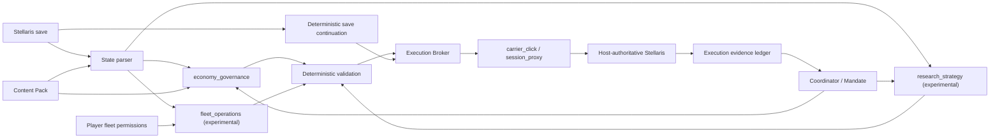

# Imperial Auto Governor Platform

Imperial Auto Governor（IAG）正在从单一的《Stellaris》经济建设 Agent，演进为一个可承载多个领域 Application 的群星 Agent 平台。

正式版 `v0.5.9` 在已跑通的 v0.5.8 建设链上，将 Windows 会话代理提升为推荐执行方式，并加入实验性的 `fleet_operations` 与 `research_strategy` Application。经济治理仍由 `economy_governance` 承担；外交等领域尚未实现。

经济治理、科研策略和舰队行动现在分别由独立的持久 Agent 运行。三者拥有各自的角色提示词、工具白名单、会话历史和 Application 模型绑定；网页会话栏可以明确选择对话对象。旧配置只有经济模型绑定时，科研和舰队会临时沿用该模型，但不会取得经济工具，也不会自动改写玩家配置。所有游戏副作用仍通过同一个控制台任务锁串行执行。

## 核心链路

IAG 的核心不是 Clausewitz Mod 直接修改玩家殖民地，而是经过验证的联机协作执行链。玩家可以选择两种执行方式：

- `session_proxy`：Windows 推荐模式。合作端进房前启动会话代理，先按本机 Stellaris/Steam UDP 端口发现局域网直连或公网中继的实际可靠流，再插入已验证的完整命令并持续维护偏移、ACK 与 actor serial 映射；不依赖载体 Mod 或固定点击校准。
- `carrier_click`：兼容模式。载体 Mod 让载体星球产生合法命令，Host Bridge 在命令进入房主前做受约束改写；选择该模式后，网页才显示载体点击校准与固定点击校验设置。

两种方式共同遵守以下状态与审计流程：

1. 房主存档同步到 Agent 端。
2. 存档解析器生成帝国、殖民地、科研、舰队、区划、区域与建筑槽状态。
3. 规则引擎生成游戏当前允许的候选，模型只从候选中决策。
4. Execution Broker 根据玩家选择调用载体点击链或会话代理链。
5. 房主权威实例处理经过确定性校验的命令并广播结果。
6. 执行链将广播与精确动作目标相关联，拒绝用相似回包冒充确认。
7. 动作若依赖游戏新分配的 ID，新存档直接唤醒固定续接器，不再重复调用模型。
8. 执行账本依据网络证据或后续存档确认结果，而不是相信模型自述。



## v0.5.9 协议执行覆盖

会话代理目前登记 25 个可独立验收的动作。每个动作都具有结构化目标、离线 fixture、动态长度构造和房主权威回包相关性检查：

| 领域 | 已接入会话代理的动作 |
|---|---|
| 殖民地经济 | 建筑建设、升级、替换，基础区划建设，区域特化 |
| 科研 | 开始科研、停止科研 |
| 舰队 | 跨对象移动、星系内坐标移动、攻击敌对舰队、返港维修、前往指定船坞升级 |
| 民用舰船 | 科研船／工程船自动化，工程船建造恒星基地 |
| 殖民 | 订购殖民船并殖民、现成殖民船发起殖民 |
| 恒星基地 | 升级，模块建造／替换，建筑建造／替换 |
| 舰船与编制 | 船坞直接建造、创建舰船设计、创建舰队模板、目标编制增减、选中舰队增援 |

其中新增的 `6b33`、`8f32`、`8f2f`、`e02c`、`3d37`、`e62c` 及恒星基地 `b43d` 子类型均来自 Stellaris 4.4.6 的非房主请求／房主权威广播配对。`8f32` 自动化和 `3d37` 同时验证了超过 255 字节时的 `00 00 PP` 应用长度分帧。

“已接入执行器”不等于“模型可以提交任意 ID”。`fleet_operations` 现在会从最新存档生成敌对舰队、受损或可升级舰队、己方船坞队列、民用船、相邻已勘探建站目标、殖民和恒星基地候选，并在发包前重新生成同一候选。军用舰队与民用船受逐船队权限约束；维修／升级、殖民、恒星基地操作和已有组件替换分别有独立玩家开关。宜居度与普通恒星基地规则来自匹配版本的本机原版文件。

科研船自动化已覆盖探索、勘探、特殊项目、异常现象、考古遗址、星界裂隙和投放重力陷阱；存档若显示该科研船由内阁科学官带队，候选层会移除星界裂隙选项。工程船自动化已覆盖采矿站、研究站、观测站和特殊项目。舰队返港维修使用 `8f32` 的独立已验证结构；升级使用 `8f2f`，其中 `c33d` 必须取自目标恒星基地的 `shipyard_build_queue`，不能拿星系或恒星基地对象代替。

舰队状态还会把每艘船的当前船体、装甲和护盾除以各自最大值，再按舰队汇总平均百分比与中位百分比。Agent 不接收逐船耐久列表或完整 `ship_ids`，因此大型舰队不会仅因耐久审计线性扩大上下文。

`3d37` 订购殖民船路径中的 `c33d` 已由多物种差分和存档交叉确认是己方 `shipyard_build_queue`；`d83d` 在现有样本中始终是 `0xffffffff`，因此仅作为已验证哨兵保留，不为它编造语义。选中舰队增援只发送配对确认的单条 `123b`；`f23b` 没有出现在该动作的干净样本中，现归为尚未解析的全帝国增援路径，不向 Agent 暴露。

`e62c` 现成殖民船路径仍只进入协议兼容性验收，因为现有样本尚不能证明初始规划如何持久化；自动化取消命令 `6836` 的选择字段也尚未确定。这两条路径不会由 Agent 猜测构造。

## 工程结构

| 目录 | 职责 |
|---|---|
| `src/iag/core` | Agent 契约、Mandate、会话、上下文与 Application 注册机制 |
| `src/iag/stellaris/state` | 存档接收、解析与游戏状态规范化 |
| `src/iag/stellaris/execution` | 点击、端口发现、拦截、确认和执行监督 |
| `src/iag/applications/economy_governance` | 殖民地建设与经济治理 Agent、规则和工具 |
| `src/iag/applications/fleet_operations` | 独立的实验性舰队与扩张 Agent，负责逐船队授权、作战、民用船、殖民、恒星基地、舰船设计与 Fleet Manager 编制增援 |
| `src/iag/applications/research_strategy` | 独立的实验性科研 Agent、三系科研状态、候选验证与科技选择工具 |
| `src/iag/infrastructure` | 模型供应商和联网检索适配器 |
| `apps/control_center` | 网页控制台和 Windows Agent 启动器 |
| `apps/host_bridge` | 房主侧存档上传、入站改写和 GUI |
| `apps/game_overlay` | 游戏上方的透明会话叠加层；只显示玩家输入与模型可见回复 |
| `content_packs` | 原版或 Mod 内容到平台既有概念的声明式映射 |
| `stellaris_mod` | 建设载体星系与载体殖民地 Clausewitz Mod |
| `scripts` | 构建、部署、诊断和可复现迁移脚本 |
| `services/research` | 可选的 SearXNG/Crawl4AI 检索服务配置 |
| `docs/code-map` | 按职责解释每个文件的代码地图 |

## 本地开发

需要 Python 3.11 或更新版本。

```powershell
cd C:\path\to\imperial-auto-governor
python -m venv .venv
.\.venv\Scripts\Activate.ps1
python -m pip install --upgrade pip
python -m pip install -r requirements.txt
python -m pip install -e .
$env:IAG_PROJECT_ROOT = (Get-Location).Path
python -m apps.control_center.web_console --help
```

开发叠加层时额外安装可选依赖：

```powershell
python -m pip install -e ".[overlay]"
python -m apps.game_overlay.main --preview
```

房主侧正式使用时不需要从源码单独启动。已配对 Host Bridge 包会携带独立的
`IAGOverlay.exe`，在房主执行桥中点击“启动游戏叠加层”即可。锁定态完全鼠标穿透；
默认以 `Ctrl+Shift+Space` 切入输入，再按同一热键退出输入并把焦点还给 Stellaris。
界面使用支持简体中文的 Fusion Pixel 等宽点阵字体。另有完全本地、无需 Agent 认证的
`IAGOverlayDisplayTest.exe`，用于单独检查拖动、缩放、分析文案和流式显示效果。

Linux 端可运行：

```bash
./scripts/deploy/install_ubuntu.sh
./scripts/deploy/start_console.sh
```

运行数据默认写入 `runtime/`，不会进入 Git。Windows 与 Linux 的抓包依赖由 `requirements.txt` 的环境标记分别安装。

`session_proxy` 当前只支持 Windows。Windows Agent 必须以管理员身份启动代理，并且代理必须在合作端加入房间前进入 READY，直到合作端退出房间后才能停止。房主 IP 仅作为直连提示；Steam 公网/中继会话会从本机 Stellaris 与 Steam 进程拥有的 UDP 端口发现实际对端，锁定后才打开精确修改过滤器。第一次自动识别 actor 前，需要合作玩家在本局自然发出一条命令；也可以由玩家显式配置 actor。

## 模型网关

模型协议与网络传输分别配置。一个逻辑 `ModelPool` 可以包含官方服务、中转站或 OpenRouter 等多个 `ModelEndpoint`，并按玩家设置的优先级从低到高使用。`openai_sdk` 支持 Responses 与 Chat Completions 兼容端点，`anthropic_sdk` 支持 Anthropic Messages API；`raw_http` 仅为路径或鉴权行为特殊的兼容服务保留。前端只提供 `OpenAI Compatible` 和 `Anthropic API` 两个预填模板，应用后的所有字段仍可编辑。DeepSeek 等服务可作为普通 OpenAI Compatible 端点配置，不再维护专用模板。

池会在明确的鉴权、额度、模型缺失或连接错误后尝试下一端点，不会对可能已被服务端接受的 5xx、超时或未知错误自动重放。前端可用端点配置的 Models 路径做无聊天请求的可达性检查。供应商特有参数仍可由 Raw JSON 配置，并通过 SDK `extra_body` 发送。

各端点 API Key 写入玩家本机、被 Git 忽略的运行配置，公开接口只返回是否已配置，不返回密钥。示例配置只含 `YOUR_API_KEY` 占位符。

## 开发边界

- `Application` 是平台能力模块，例如 `economy_governance`。
- `Content Pack` 只声明“某个游戏或 Mod 内容对应平台已有的什么概念”，不得执行 Python 代码。
- 若新内容要求平台此前不存在的动作、状态或执行协议，应扩展平台或 Application，而不是把代码藏进 Content Pack。
- 专业 Agent 可在当前 Mandate 内自主决策；主总管通过发布一份新的完整 Mandate 改变其目标与边界。
- 游戏副作用必须经过确定性验证和统一执行，不允许模型任意执行 Python。

## 文档入口

- [总体架构](docs/ARCHITECTURE.md)
- [会话代理模式](docs/SESSION_PROXY_MODE.md)
- [版本更新后的协议兼容性验收](docs/protocol/PROTOCOL_COMPATIBILITY_SUITE.md)
- [舰队行动实验功能](docs/FLEET_OPERATIONS.md)
- [舰队维修与升级协议证据](docs/protocol/FLEET_MAINTENANCE_4_4_6.md)
- [科研战略实验功能](docs/RESEARCH_STRATEGY.md)
- [迁移说明](docs/MIGRATION.md)
- [开发约定](docs/DEVELOPMENT.md)
- [逐文件代码地图](docs/code-map/FILE_INDEX.md)
- [v0.5.8 原始运行文档](docs/reference/v0_5_8/AGENT_RUNTIME.md)
- [游戏内对话叠加层](apps/game_overlay/README.md)
- [v0.5.9 版本说明](docs/releases/v0.5.9.md)

## 许可证

代码采用 GPL-3.0-only；项目文档采用 CC BY-SA 4.0。版权与项目起源见 `NOTICE`、`ORIGIN.md` 和 `AUTHORS.md`。
