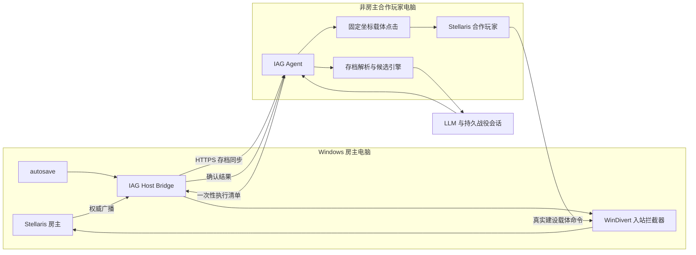

<!-- SPDX-FileCopyrightText: 2026 Nostalgia and Imperial Auto Governor contributors -->
<!-- SPDX-License-Identifier: CC-BY-SA-4.0 -->

# Imperial Auto Governor / 帝国内政总管

Imperial Auto Governor 是一个面向 Stellaris 多人合作模式的实验性 LLM 内政执行系统。它读取房主同步存档中的帝国完整状态，由规则引擎生成合法建设候选，让 LLM 结合长期战略和玩家要求选择动作，再通过合作玩家的真实游戏命令完成受约束的网络改写。

这不是一个只靠 Clausewitz 脚本运行的传统自动建设 mod。项目核心是以下闭环：

```text
房主 autosave
  -> 存档上传与完整性验证
  -> 帝国状态提取和合法候选生成
  -> LLM 规划
  -> 合作端执行真实载体点击
  -> Windows 房主端 WinDivert 入站抓包和命令改写
  -> 房主处理并广播权威结果
  -> 权威回包或下一份存档确认
```

游戏内 mod 只是执行链的一部分。它提供稳定、可重复的合法载体命令，不负责读取 API、调用模型或独立完成自动建设。

## 核心架构



一次建设按以下顺序执行：

1. 房主端 `IAGHostBridgeGUI` 等待 autosave 写入稳定，验证 Stellaris ZIP 结构并通过 HTTPS 上传。
2. Agent 校验 SHA-256、战役身份和会话绑定，从存档提取资源、收支、殖民地、岗位、住房、舒适度、稳定度、犯罪、区划、zone、建筑和建设队列。
3. 本地规则引擎只生成当前存档和本地 4.4.6 定义能够证明合法的建设候选。
4. LLM 读取当前战役会话、十年计划、紧急状态和合法候选，选择零项或多项串行建设。
5. 每个动作先生成绑定存档哈希的一次性执行清单。房主桥以管理员权限打开只匹配当前合作端的 WinDivert 入站句柄并回报 `READY`。
6. Agent 在合作端 Stellaris 中执行已经校准的固定坐标序列，产生真实、合法、与目标同命令族的载体点击。
7. 房主桥在命令进入房主前改写已经验证的业务字段，同时保持 UDP payload 长度、命令记录长度、命令数量和 serial 不变。
8. 只有捕获到房主权威广播，或后续新存档精确证明目标已进入队列或建成，动作才会写入事实账本。

## 为什么需要合作玩家和载体 mod

Stellaris 的游戏脚本不能读取任意本地文件、调用外部模型 API，也不能把外部规划实时变成原生玩家命令。直接伪造新数据包、跨会话重放旧包或向可靠流插入额外命令，都在实测中导致过不同步、时间停滞或命令被拒绝。

当前可行路线依赖一个非房主合作玩家：

- 合作端通过正常 UI 产生本局、本连接下的合法命令及客户端预测。
- 房主端只改写这条正在流入的命令，不凭空构造 transport header、ACK、offset 或 command serial。
- 房主仍是最终权威，目标建设必须由房主执行并广播。
- 每个动作使用一次性拦截器；端口在重连、重启或新房间后重新发现，不复用旧会话数据。

载体 mod 的意义不是代替抓包，而是给自动执行器提供低干扰、位置固定、命令族正确且长度足够的源动作。

## 当前支持范围

当前生产能力以 Stellaris 4.4.6 的本地规则和实机配对样本为基线：

| 动作族 | 合法载体 | 当前能力 |
| --- | --- | --- |
| 建筑建设 | `building_upc_construction_command_relay` | 重定向到合法殖民地、zone 和建筑槽 |
| 主区划建设 | `district_generator` | 城市、发电、采矿和农业区划 |
| 区划特化 | `zone_research_engineering` | 已验证的工业、科研、行政、贸易等特化 |
| 建筑升级 | `building_upc_upgrade_command_relay_target` | 按目标建筑对象和精确槽位升级 |
| 建筑替换 | `building_upc_replacement_command_relay_target` | 仅对存档明确证明为继承/征服的殖民地，按精确源对象和槽位重构普通建筑；v0.5.7 专用载体需首次实局验收 |

同一轮可以执行多项建设，但始终按 `prepare A -> execute A -> 确认 A -> prepare B` 串行运行。默认每轮最多三项；任一动作失败、等待确认或规划存档超过玩家设置的版本容差时，后续动作都会停止。

每次接受新的房主存档时，Agent 会为当前战役记录单调递增的上传 revision。网页“执行与确认”区可以设置规划存档最多落后几个上传版本，默认值为 2，设为 0 即恢复“只能使用最新存档”的严格模式。容差只允许已经开始的串行批次继续，不会改变源存档哈希、战役绑定或墙钟时效校验。自主巡检仍保证同一时刻只有一个模型任务；如果一轮分析跨过了原定复查月份，过期触发点会被合并，下一轮从之后的周期边界开始。

固定坐标点击仍会保存点击前截图和模板匹配分数。玩家可以在同一设置区关闭“固定点击界面校验”；关闭后低分不再阻止点击，但窗口数量、窗口尺寸和目标坐标边界仍会检查。该开关用于已人工确认界面正确但模板分数轻微波动的场景，关闭时应自行承担误点风险。

以下对象默认转人工处理：

- 度假星球、事件星球和结构无法可靠解析的特殊殖民地。
- 尚未取得真实命令样本或未完成本地规则建模的命令族。
- 原始拥有者缺失、与当前拥有者相同，或源建筑不在保守白名单中的替换。
- 舰队、外交、战争、人口迁移、政策和市场操作。

## 抓包与改写边界

生产路线运行在 Windows 房主电脑上，使用 WinDivert 捕获非房主合作玩家发往房主的入站 UDP 流量。它不是通用数据包注入器，也不会让 LLM 自由编写十六进制命令。

执行器遵守以下约束：

- 必须使用本局实时出现的真实载体命令。
- 只处理一次性执行清单指定的合作端、动作族和目标。
- 保留可靠传输头、未知字段、命令数量、serial 和 UDP payload 总长度。
- 不插入新命令，不重放旧 payload，不跨会话复用端口或传输状态。
- 新命令族必须先被动抓包、采集成对样本、做 byte diff、增加测试，再允许实机改写。
- 明文回包没有命中时不能宣称成功，只能进入 `provisional_pending_save` 并等待新存档核验。

该功能只应在参与者知情并授权的私人合作对局中使用。Stellaris 更新可能改变命令结构；升级游戏版本后应重新验证载体样本和本地定义。

## 项目组件

| 路径 | 作用 |
| --- | --- |
| `tools/agent_runtime/` | Agent、网页前端、模型会话、十年计划、候选引擎、固定点击与执行编排 |
| `tools/windows_save_uploader/` | Windows 房主 GUI、autosave 上传、心跳、一次性 WinDivert 入站改写与权威确认 |
| `tools/packet_interceptor/` | 抓包分析、精确替换器、命令族研究工具和回归测试 |
| `tools/save_state/` | Stellaris 4.x 存档解析与结构化行星资料提取 |
| `common/`、`events/`、`localisation/` | 游戏内 LLM 建设载体飞地 mod |
| `docs/` | 安装、技术架构、研究服务和发布流程 |

完整会话、API Key、上传令牌、存档、抓包、运行日志和数据库属于本地运行数据，不进入源码仓库或公开发布包。

## 游戏内载体组件

`LLM Construction Carrier / LLM 建设载体` mod 通过政府法令创建首都直连的 `灰风` 星系，以及 `川陀` 和 `端点星` 两颗受保护的 25 格盖亚载体殖民地。它还负责：

- 创建玩家哨站并将载体殖民地交给当前玩家。
- 消除住房、舒适度、稳定度、犯罪和维护费对载体操作的干扰。
- 在维护时修复旧档角色标记、名称、端点星和首都航道。
- 对进入灰风的非星系拥有者舰队触发 `第四面墙`，使其 MIA 42 天后返回。
- 显式移除失落帝国圣地标记和 `holy_planet` 修正。

当前固定载体目录由独立的 `Carrier Construction Console / 载体统一建设控制台` 0.4.2 提供。它只改造带 `iag_carrier_building_world` 标记的川陀，不影响普通殖民地。0.4.2 为建筑替换增加独立、已占用的载体区域，不会把替换候选混入普通建筑列表。当前创意工坊文件 ID 为 `3774390530`。

两个游戏端模组必须由房主和合作玩家使用一致版本加载。模组本身不会抓包、点击、调用 LLM 或直接在目标星球瞬间添加建筑。

## 部署方式

生产路线要求房主使用 Windows，因为受验证的改写位置是房主端入站 WinDivert。Agent 可以运行在另一台 Windows 或 Ubuntu 电脑上，同时承载非房主合作玩家的 Stellaris 客户端。

### 两台 Windows

```text
房主电脑: Stellaris + IAGHostBridgeGUI
合作端电脑: Stellaris + IAGWindowsAgent + LLM 配置
```

Windows Agent 快速开始见 [docs/WINDOWS_AGENT_README.md](docs/WINDOWS_AGENT_README.md)，两台 Windows
从零部署和首次实局验收见 [docs/WINDOWS_FULL_DEPLOYMENT.md](docs/WINDOWS_FULL_DEPLOYMENT.md)。

### Windows 房主和 Ubuntu 合作端

```text
房主电脑: Windows Stellaris + IAGHostBridgeGUI
合作端电脑: Ubuntu Stellaris + IAGUbuntuAgent + X11 固定点击
```

Ubuntu 独立安装见 [docs/UBUNTU_AGENT_README.md](docs/UBUNTU_AGENT_README.md)。

## 首次实局流程

1. 在房主和合作端启用相同版本的两个游戏端模组，并让合作玩家以同一帝国的合作角色加入。
2. 在游戏内使用政府法令创建或维护灰风载体飞地；让时间推进到统一建设控制台完成初始化。
3. 在房主电脑以管理员权限启动 `IAGHostBridgeGUI`，填写 Agent 地址、证书指纹和桥接令牌，确认存档目录后点击“开始上传”。
4. 在合作端启动 Agent，配置 Stellaris 路径、模型 Base URL、模型名、API Key 和上下文参数。
5. 新建战役会话，并由玩家把当前上传存档明确绑定到该会话。
6. 按前端提示校准五个动作族的十个窗口相对坐标步骤，并先使用“仅移动鼠标”检查位置；建筑替换依次校准源建筑、替换按钮和目标候选。
7. 先使用“自主分析，只准备规划”，检查存档状态、合法候选、端口和模型判断。
8. 验收无误后切换到“自主分析并执行建设”。每份达到复查月份的新存档会触发下一轮审计。

完整操作手册见 [tools/agent_runtime/README.md](tools/agent_runtime/README.md)，房主桥说明见 [tools/windows_save_uploader/README.md](tools/windows_save_uploader/README.md)。

## LLM 与前端

Agent 支持 OpenAI Responses 兼容接口和 Chat Completions 兼容接口，可配置 Base URL、模型、API Key、`temperature`、超时、最大上下文、输出预留和受保护的 Raw JSON 参数。

每局游戏拥有独立的持久会话、玩家消息、灰风回复、工具审计、十年计划、紧急状态和建设事实账本。上下文达到设定比例后会生成滚动概况，但 SQLite 中的完整原始历史不会被删除。

可选联网工具包括 SearXNG、Crawl4AI 和 MediaWiki API；Wiki API 不可用时会退回受白名单约束的
SearXNG 站内检索。网页内容始终作为不可信参考，只能影响 LLM 分析，不能创建本地不存在的候选或
绕过执行器校验。玩家可在网页关闭联网总开关，关闭后下一轮不会向模型提供任何联网工具。部署说明见
[docs/RESEARCH_SERVICES.md](docs/RESEARCH_SERVICES.md)。

## 安全确认状态

| 状态 | 含义 |
| --- | --- |
| `confirmed_by_packet` | 房主权威回包明确包含目标命令 |
| `confirmed_by_save` | 更新后的房主存档精确证明动作落地 |
| `provisional_pending_save` | 已安全改写，但回包不足以确认；等待新存档 |
| `rejected_by_save` | 新存档没有出现预期变化，动作被事实账本否决 |

默认严格模式会在 `provisional_pending_save` 时停止后续点击。玩家可以显式启用宽松串行策略，但该状态仍不会被描述为“已经建成”。

## 测试

```powershell
python -m compileall -q tools
python -m unittest discover -s tools/agent_runtime/tests
python -m unittest discover -s tools/packet_interceptor -p "test_*.py"
python -m unittest discover -s tools/windows_save_uploader/tests
python -m unittest discover -s tools/save_state -p "test_*.py"
python tools/release/verify_release.py --directory public_release
```

测试源码应保留在公开仓库中；`.test_work`、缓存、抓包、日志、数据库、存档和真实配置必须排除。

## 发行附件

v0.5.7 使用五个正式附件：

```text
ImperialAutoGovernor-0.5.7-source.zip
IAGWindowsAgent-0.5.7-windows-x64.zip
IAGHostBridge-0.5.7-windows-x64.zip
IAGUbuntuAgent-0.5.7-linux-x86_64.tar.gz
SHA256SUMS-0.5.7.txt
```

源码、构建、隐私扫描、签名 Tag、GitHub Release、Zenodo 和 Software Heritage 流程见 [docs/PUBLICATION.md](docs/PUBLICATION.md)。技术架构见 [docs/TECHNICAL_OVERVIEW.md](docs/TECHNICAL_OVERVIEW.md)。

## 许可证与归属

- 程序代码：`GPL-3.0-only`。
- 文档：`CC BY-SA 4.0`。
- 原始构想、架构和首次实现：Nostalgia，2026。
- 项目起源与保留声明：[ORIGIN.md](ORIGIN.md)、[NOTICE](NOTICE)、[AUTHORS.md](AUTHORS.md)。
- 引用、贡献、DCO 与商标边界：[CITATION.cff](CITATION.cff)、[CONTRIBUTING.md](CONTRIBUTING.md)、[DCO](DCO)、[TRADEMARKS.md](TRADEMARKS.md)。

本项目仍处于实验阶段。请先在可丢弃存档和私人合作对局中验证，并始终保留可回滚的房主存档。
