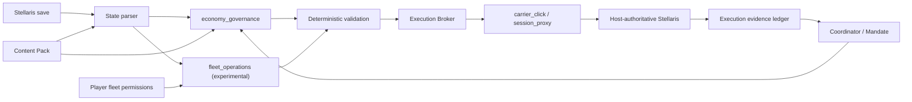

# Imperial Auto Governor Platform

Imperial Auto Governor（IAG）正在从单一的《Stellaris》经济建设 Agent，演进为一个可承载多个领域 Application 的群星 Agent 平台。

当前 `v0.5.9` Draft 在已跑通的 v0.5.8 建设链上增加了可选的会话代理执行模式，以及第一版实验性 `fleet_operations` Application。经济治理仍由 `economy_governance` 承担；外交等领域尚未实现。

## 核心链路

IAG 的核心不是 Clausewitz Mod 直接修改玩家殖民地，而是经过验证的联机协作执行链。玩家可以选择两种执行方式：

- `carrier_click`：稳定默认模式。载体星球产生合法命令，Host Bridge 在命令进入房主前做受约束改写。
- `session_proxy`：Windows 实验模式。合作端进房前启动会话代理，先按本机 Stellaris/Steam UDP 端口发现局域网直连或公网中继的实际可靠流，再插入已验证的完整命令并持续维护偏移、ACK 与 actor serial 映射。

两种方式共同遵守以下状态与审计流程：

1. 房主存档同步到 Agent 端。
2. 存档解析器生成帝国、殖民地、区划、区域与建筑槽状态。
3. 规则引擎生成游戏当前允许的候选，模型只从候选中决策。
4. Execution Broker 根据玩家选择调用载体点击链或会话代理链。
5. 房主权威实例处理经过确定性校验的命令。
6. 房主处理并广播权威结果。
7. 执行账本依据网络证据或后续存档确认结果，而不是相信模型自述。



## 工程结构

| 目录 | 职责 |
|---|---|
| `src/iag/core` | Agent 契约、Mandate、会话、上下文与 Application 注册机制 |
| `src/iag/stellaris/state` | 存档接收、解析与游戏状态规范化 |
| `src/iag/stellaris/execution` | 点击、端口发现、拦截、确认和执行监督 |
| `src/iag/applications/economy_governance` | 当前可用的殖民地建设与经济治理 Application |
| `src/iag/applications/fleet_operations` | 实验性舰队解析、逐舰队授权与已验证移动工具 |
| `src/iag/infrastructure` | 模型供应商和联网检索适配器 |
| `apps/control_center` | 网页控制台和 Windows Agent 启动器 |
| `apps/host_bridge` | 房主侧存档上传、入站改写和 GUI |
| `apps/game_overlay` | 游戏上方的透明会话叠加层；只显示玩家输入与模型可见回复 |
| `content_packs` | 原版或 Mod 内容到平台既有概念的声明式映射 |
| `stellaris_mod` | 建设载体星系与载体殖民地 Clausewitz Mod |
| `scripts` | 构建、部署、诊断和可复现迁移脚本 |
| `services/research` | 可选的 SearXNG/Crawl4AI 检索服务配置 |
| `docs/code-map` | 按职责解释每个文件的代码地图 |

## 本地开发

需要 Python 3.11 或更新版本。

```powershell
cd C:\path\to\imperial-auto-governor
python -m venv .venv
.\.venv\Scripts\Activate.ps1
python -m pip install --upgrade pip
python -m pip install -r requirements.txt
python -m pip install -e .
$env:IAG_PROJECT_ROOT = (Get-Location).Path
python -m apps.control_center.web_console --help
```

开发叠加层时额外安装可选依赖：

```powershell
python -m pip install -e ".[overlay]"
python -m apps.game_overlay.main --preview
```

房主侧正式使用时不需要从源码单独启动。已配对 Host Bridge 包会携带独立的
`IAGOverlay.exe`，在房主执行桥中点击“启动游戏叠加层”即可。锁定态完全鼠标穿透；
默认以 `Ctrl+Shift+Space` 切入输入，再按同一热键退出输入并把焦点还给 Stellaris。
界面使用支持简体中文的 Fusion Pixel 等宽点阵字体。另有完全本地、无需 Agent 认证的
`IAGOverlayDisplayTest.exe`，用于单独检查拖动、缩放、分析文案和流式显示效果。

Linux 端可运行：

```bash
./scripts/deploy/install_ubuntu.sh
./scripts/deploy/start_console.sh
```

运行数据默认写入 `runtime/`，不会进入 Git。Windows 与 Linux 的抓包依赖由 `requirements.txt` 的环境标记分别安装。

`session_proxy` 当前只支持 Windows。Windows Agent 必须以管理员身份启动代理，并且代理必须在合作端加入房间前进入 READY，直到合作端退出房间后才能停止。房主 IP 仅作为直连提示；Steam 公网/中继会话会从本机 Stellaris 与 Steam 进程拥有的 UDP 端口发现实际对端，锁定后才打开精确修改过滤器。第一次自动识别 actor 前，需要合作玩家在本局自然发出一条命令；也可以由玩家显式配置 actor。

## 模型网关

模型协议与网络传输分别配置。一个逻辑 `ModelPool` 可以包含官方服务、中转站或 OpenRouter 等多个 `ModelEndpoint`，并按玩家设置的优先级从低到高使用。默认传输 `openai_sdk` 使用官方 Python SDK 的 `AsyncOpenAI`；`raw_http` 仅为路径或鉴权行为特殊的 OpenAI-compatible 服务保留。

池会在明确的鉴权、额度、模型缺失或连接错误后尝试下一端点，不会对可能已被服务端接受的 5xx、超时或未知错误自动重放。前端可用 `GET /models` 做无聊天请求的可达性检查。供应商特有参数仍可由 Raw JSON 配置，并通过 SDK `extra_body` 发送。

各端点 API Key 写入玩家本机、被 Git 忽略的运行配置，公开接口只返回是否已配置，不返回密钥。示例配置只含 `YOUR_API_KEY` 占位符。

## 开发边界

- `Application` 是平台能力模块，例如 `economy_governance`。
- `Content Pack` 只声明“某个游戏或 Mod 内容对应平台已有的什么概念”，不得执行 Python 代码。
- 若新内容要求平台此前不存在的动作、状态或执行协议，应扩展平台或 Application，而不是把代码藏进 Content Pack。
- 专业 Agent 可在当前 Mandate 内自主决策；主总管通过发布一份新的完整 Mandate 改变其目标与边界。
- 游戏副作用必须经过确定性验证和统一执行，不允许模型任意执行 Python。

## 文档入口

- [总体架构](docs/ARCHITECTURE.md)
- [会话代理模式](docs/SESSION_PROXY_MODE.md)
- [舰队行动实验功能](docs/FLEET_OPERATIONS.md)
- [迁移说明](docs/MIGRATION.md)
- [开发约定](docs/DEVELOPMENT.md)
- [逐文件代码地图](docs/code-map/FILE_INDEX.md)
- [v0.5.8 原始运行文档](docs/reference/v0_5_8/AGENT_RUNTIME.md)
- [游戏内对话叠加层](apps/game_overlay/README.md)
- [v0.5.9 Draft 说明](docs/releases/v0.5.9.md)

## 许可证

代码采用 GPL-3.0-only；项目文档采用 CC BY-SA 4.0。版权与项目起源见 `NOTICE`、`ORIGIN.md` 和 `AUTHORS.md`。
