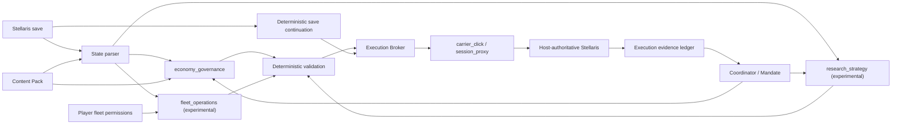

# Imperial Auto Governor Platform

Imperial Auto Governor（IAG）正在从单一的《Stellaris》经济建设 Agent，演进为一个可承载多个领域 Application 的群星 Agent 平台。

正式版 `v0.5.10` 在 v0.5.9 的多领域执行能力上加入共享世界快照、计划驱动自主运行、Application 私有通讯线程和完整舰船设计闭环。Windows 会话代理仍是推荐执行方式；实验性的 `fleet_operations` 与 `research_strategy` Application 需由玩家显式启用。经济治理仍由 `economy_governance` 承担；外交等领域尚未实现。

经济治理、科研策略和舰队行动现在分别由独立的持久 Agent 运行。三者拥有各自的角色提示词、工具白名单、会话历史、计划书和 Application 模型配置；网页会话栏可以明确选择对话对象。玩家可以让每个 Application 独立选择模型池与逻辑模型，也可以让专业 Agent 显式沿用经济治理当前的模型路由和请求参数。沿用模式会在经济模型切换后动态跟随，但不会共享工具权限、上下文压缩／联网设置或私有会话历史。旧配置只有经济模型绑定时仍可临时回退，且不会被启动过程擅自改写。三个领域的状态检查和模型推理可以并行进行，所有准备、执行和资源预留仍通过同一个进程锁与 SQLite 账本串行提交。

## 核心链路

IAG 的核心不是 Clausewitz Mod 直接修改玩家殖民地，而是经过验证的联机协作执行链。玩家可以选择两种执行方式：

- `session_proxy`：Windows 推荐模式。合作端进房前启动会话代理，先按本机 Stellaris/Steam UDP 端口发现局域网直连或公网中继的实际可靠流，再插入已验证的完整命令并持续维护偏移、ACK 与 actor serial 映射；不依赖载体 Mod 或固定点击校准。自动识别未收敛时，控制台会列出当前候选四元组，玩家可在确认已同步房间流量后手动锁定。
- `carrier_click`：兼容模式。载体 Mod 让载体星球产生合法命令，Host Bridge 在命令进入房主前做受约束改写；选择该模式后，网页才显示载体点击校准与固定点击校验设置。

两种方式共同遵守以下状态与审计流程：

1. 房主存档同步到 Agent 端。
2. 存档解析器生成帝国、殖民地、科研、舰队、区划、区域与建筑槽状态。
3. 规则引擎生成游戏当前允许的候选，模型只从候选中决策。
4. Execution Broker 根据玩家选择调用载体点击链或会话代理链。
5. 房主权威实例处理经过确定性校验的命令并广播结果。
6. 执行链将广播与精确动作目标相关联，拒绝用相似回包冒充确认。
7. 动作若依赖游戏新分配的 ID，新存档直接唤醒固定续接器，不再重复调用模型。
8. 跨 Application 资源账本以当前存档哈希预留支出，避免多个专业 Agent 重复花费同一份旧库存。
9. 执行账本依据网络证据或后续存档确认结果，而不是相信模型自述。



## 计划驱动自主运行

每个第一方 Application 都可以用同一组计划工具创建、读取和局部编辑自己的活动计划书。
计划节点保存层级目标、显式依赖、模型选择的容差、激活／停止／完成条件，以及可选的
确定性 `prepare_*`／`execute_*` 动作。条件只能引用该领域读取工具实际返回的稳定事实路径。

自主巡检先由本地 `ApplicationPlanBook` 读取并比较计划真正监视的事实。状态仍在容差内时，
本地程序直接继续、等待或执行已经完全确定的下一步，不调用模型；超出范围时只失效直接
相关节点及其真实依赖项，保留上层目标、已完成节点和无关分支。每次创建、局部修改、豁免、
工具结果和存档确认都写入持久审计，完成或取消的旧计划会进入有限归档。

玩家可以为小偏差选择一个独立的“快速参谋”模型。它只收到异常、受影响计划片段和相关
事实，只能确认继续、提交受范围约束的局部补丁，或压缩问题后升级给本领域主模型；未配置
时直接走最后一种路径。主模型的局部异常回合也不会加载完整会话、完整计划或全局状态。
默认每 12 个游戏月进行一次跨领域联合审查：主模型只读取三本计划的压缩摘要与已经监视的
事实，并把建议投递给对应领域；联合审查不能直接修改其他 Application 的计划。

## 共享世界快照与 Application 通讯

一次自主轮次先固定当前存档的路径、哈希、战役和上传 revision，随后所有 Application 都只
读取这一个 `WorldSnapshot`。`WorldStateIndex` 对 country、fleet、planet、system、war、
starbase、construction 等公共区段做线程安全的 single-flight 构建；同一快照中的完整文本、
数字对象表、舰队／入侵／扩张／科研状态和战役路线规划器不会被每个 inspector 重复解压和
解析。新存档先按依赖顺序预热 CPU 密集的公共状态，再用默认 4 个共享内存 worker 并行处理
独立只读工具和各 Application 的局部计算，避免 Windows 多进程复制整份银河。热路线和派生
状态继续保留在快照内；切换存档时只保留当前热快照，仍在运行的旧轮次依靠自身引用完成。

只读 worker 具有批次超时、异常隔离和 generation 退役恢复；一项读取卡住不会永久占满后续
任务池。`prepare_*`、`execute_*`、网络发包、资源预留及 Plan 修改不进入该并行池，仍由执行
锁、SQLite 事务和 `expected_revision` 串行保护，并在准备和执行前分别确认当前存档仍是本轮
快照。Plan 的正常节点只读取自己监视的事实且不调用模型；异常节点只向参谋或领域模型提供
局部上下文。

网页会话区以 Application 联系人列表呈现。经济、舰队和科研各自拥有独立 SQLite 历史、模型
上下文和可见聊天线程；当前选中的联系人决定消息写入目标，后台自主报告回到所属线程。最近
活动只用于联系人排序、预览和未读提示，不会再把多个领域按时间拼成一条全局聊天记录。跨
领域协作保留为显式的联合复盘记录。

## v0.5.10 协议执行覆盖

会话代理目前登记 28 个可独立验收的动作。每个动作都具有结构化目标、离线 fixture、动态长度构造和房主权威回包相关性检查：

| 领域 | 已接入会话代理的动作 |
|---|---|
| 殖民地经济 | 建筑建设、升级、替换，基础区划建设，区域特化 |
| 科研 | 开始科研、停止科研 |
| 舰队 | 跨对象移动、星系内坐标移动、攻击敌对舰队、轨道轰炸、返港维修、前往指定船坞升级 |
| 入侵与陆军 | 运输舰队登陆敌方殖民地、机器人进攻部队定量招募 |
| 民用舰船 | 科研船／工程船自动化，工程船建造恒星基地 |
| 殖民 | 订购殖民船并殖民、现成殖民船发起殖民 |
| 恒星基地 | 升级，模块建造／替换，建筑建造／替换 |
| 舰船与编制 | 船坞直接建造、多区段完整舰船设计、创建舰队模板、目标编制增减、选中舰队增援 |

其中新增的 `6b33`、`8f32`、`8f2f`、`e02c`、`3d37`、`e62c`、轨道轰炸姿态 `d62d`、陆军登陆 `6f33`、陆军招募 `b43d`、舰船设计 `fb2d` 及恒星基地 `b43d` 子类型均来自 Stellaris 4.4.6 的非房主请求／房主权威广播配对或结构配对。`8f32` 自动化、`3d37` 和完整舰船设计同时验证了超过 255 字节时的 `00 00 PP` 应用长度分帧。

“已接入执行器”不等于“模型可以提交任意 ID”。`fleet_operations` 现在会从最新存档生成敌对舰队、受损或可升级舰队、己方船坞队列、民用船、相邻已勘探建站目标、殖民、恒星基地和敌方殖民地入侵候选，并在发包前重新生成同一候选。军用舰队与民用船受逐船队权限约束；轰炸、运输舰队登陆、维修／升级、殖民、恒星基地操作和已有组件替换分别有玩家开关或逐舰队授权。宜居度、普通恒星基地与当前开放陆军规则来自匹配版本的本机原版文件。

`CampaignRoutePlanner` 会在战争目标之间执行有界多目标 Pareto 路径搜索，并把跳数、
阻断数量、恒星基地军力、行星抑制器、守军生命池、未知风险和现有走廊占用分别列明。
Pareto 筛选后再用确定性的 UCB/MCTS 风格探索奖励和拥堵惩罚排序，让后续舰队优先考虑
未使用的等价走廊，而不会绕过关闭边境或可达性校验。全局部署视图同时给出战线军力、
无人驻防的占领区／前沿星系，并按相对军力建议突破舰队、战列线或小舰队守备。固定续接器
只清除当前合法的第一道阻断，每次改变游戏后等待新存档，不会直接构造对后方受阻对象的
攻击。陆军生命池比较是保守启发式而非完整战斗模拟，最终占领仍以行星 controller 的
后续存档变化为准。

兵力集中高于路线分流：攻击前会按目标星系汇总全部已知敌军，并将来源舰队与已在场／
正在抵达的友军按 ID 去重求和。默认空间军力安全系数为 `1.20`，可在控制台调整；部署器
只会把能够整体越过安全线的舰队集合登记为原子 `task_force_package`。不足以闭合缺口时
不会生成单舰进攻分配，普通攻击与战役攻击也会拒绝发包；未知敌军军力同样不会按零处理。
探索项因此只负责在“打得过”的集结包和路线之间分流，不负责决定是否开战。

轨道轰炸会在一个行动锁内先发送 `d62d` 姿态，再发送以敌方行星对象为目标的 `d32c`；陆军登陆则使用独立 `6f33`，固定层把行星解析为 colony 对象。机器人陆军招募从 `type=army` 队列、来源 colony、物种和招募空间站生成候选；数量 1–5 按实抓行为展开成 N 条普通 `b43d`，没有虚构的批量字段。任何一步失败都会停止余下序列。

舰船设计同样不是让模型拼二进制。模型先选择一份玩家当前可见且可编辑的设计，再按需查询可用区段和单个区段的槽位候选；当国家已经关闭自动设计时，存档仍可能保留旧的 `auto_gen_design=yes` 隐藏模板，解析器会保留这些底层记录但不会把它们暴露给模型或允许其作为设计锚点。确定性层负责区段位置、组件类型、已研究科技、各舰型必需组件（包括泰坦／主宰的舰船光环）、战斗电脑角色、自动升级双标签与可解析功率余额。玩家未指定时，舰队 Agent 会依据舰型和战术职责自主拟定唯一设计名；确定性层仍检查长度、字符集和重名，且原设计始终保留。2026-09-09 的战列舰／巡洋舰样本已经覆盖舰艏、核心、舰艉替换，重复同型武器槽、X 槽、机库、辅助槽、战斗电脑及自动升级开关，并通过完整记录 SHA-256 回归。

科研船自动化已覆盖探索、勘探、特殊项目、异常现象、考古遗址、星界裂隙和投放重力陷阱；存档若显示该科研船由内阁科学官带队，候选层会移除星界裂隙选项。工程船自动化已覆盖采矿站、研究站、观测站和特殊项目。舰队返港维修使用 `8f32` 的独立已验证结构；升级使用 `8f2f`，其中 `c33d` 必须取自目标恒星基地的 `shipyard_build_queue`，不能拿星系或恒星基地对象代替。

舰队状态还会把每艘船的当前船体、装甲和护盾除以各自最大值，再按舰队汇总平均百分比与中位百分比。Agent 不接收逐船耐久列表或完整 `ship_ids`，因此大型舰队不会仅因耐久审计线性扩大上下文。

`3d37` 订购殖民船路径中的 `c33d` 已由多物种差分和存档交叉确认是己方 `shipyard_build_queue`；`d83d` 在现有样本中始终是 `0xffffffff`，因此仅作为已验证哨兵保留，不为它编造语义。选中舰队增援只发送配对确认的单条 `123b`；`f23b` 没有出现在该动作的干净样本中，现归为尚未解析的全帝国增援路径，不向 Agent 暴露。

`e62c` 现成殖民船路径仍只进入协议兼容性验收，因为现有样本尚不能证明初始规划如何持久化；自动化取消命令 `6836` 的选择字段也尚未确定。这两条路径不会由 Agent 猜测构造。

## 工程结构

| 目录 | 职责 |
|---|---|
| `src/iag/core` | Agent 契约、Mandate、会话、上下文与 Application 注册机制 |
| `src/iag/stellaris/state` | 存档接收、解析与游戏状态规范化 |
| `src/iag/stellaris/execution` | 点击、端口发现、拦截、确认和执行监督 |
| `src/iag/applications/economy_governance` | 殖民地建设与经济治理 Agent、规则和工具 |
| `src/iag/applications/fleet_operations` | 独立的实验性舰队与扩张 Agent，负责逐船队授权、作战、民用船、殖民、恒星基地、舰船设计与 Fleet Manager 编制增援 |
| `src/iag/applications/research_strategy` | 独立的实验性科研 Agent、三系科研状态、候选验证与科技选择工具 |
| `src/iag/infrastructure` | 模型供应商和联网检索适配器 |
| `apps/control_center` | 网页控制台和 Windows Agent 启动器 |
| `apps/host_bridge` | 房主侧存档上传、入站改写和 GUI |
| `apps/game_overlay` | 游戏上方的透明会话叠加层；只显示玩家输入与模型可见回复 |
| `content_packs` | 原版或 Mod 内容到平台既有概念的声明式映射 |
| `stellaris_mod` | 建设载体星系与载体殖民地 Clausewitz Mod |
| `scripts` | 构建、部署、诊断和可复现迁移脚本 |
| `services/research` | 可选的 SearXNG/Crawl4AI 检索服务配置 |
| `docs/code-map` | 按职责解释每个文件的代码地图 |

## 本地开发

需要 Python 3.11 或更新版本。

```powershell
cd C:\path\to\imperial-auto-governor
python -m venv .venv
.\.venv\Scripts\Activate.ps1
python -m pip install --upgrade pip
python -m pip install -r requirements.txt
python -m pip install -e .
$env:IAG_PROJECT_ROOT = (Get-Location).Path
python -m apps.control_center.web_console --help
```

开发叠加层时额外安装可选依赖：

```powershell
python -m pip install -e ".[overlay]"
python -m apps.game_overlay.main --preview
```

房主侧正式使用时不需要从源码单独启动。已配对 Host Bridge 包会携带独立的
`IAGOverlay.exe`，在房主执行桥中点击“启动游戏叠加层”即可。锁定态完全鼠标穿透；
默认以 `Ctrl+Shift+Space` 切入输入，再按同一热键退出输入并把焦点还给 Stellaris。
界面使用支持简体中文的 Fusion Pixel 等宽点阵字体。另有完全本地、无需 Agent 认证的
`IAGOverlayDisplayTest.exe`，用于单独检查拖动、缩放、分析文案和流式显示效果。

Linux 端可运行：

```bash
./scripts/deploy/install_ubuntu.sh
./scripts/deploy/start_console.sh
```

运行数据默认写入 `runtime/`，不会进入 Git。Windows 与 Linux 的抓包依赖由 `requirements.txt` 的环境标记分别安装。

`session_proxy` 当前只支持 Windows。Windows Agent 必须以管理员身份启动代理，并且代理必须在合作端加入房间前进入 READY，直到合作端退出房间后才能停止。房主 IP 用于识别直连或 Tailnet 对端；Steam 公网/中继会话会从本机 Stellaris 与 Steam 进程拥有的 UDP 端口发现实际对端，锁定后才打开精确修改过滤器。自动规则会在端口扫描晚于首包时升级候选归属：唯一的进程归属直连流可凭双向流量，或同一方向稳定出现的可靠帧锁定；中继流仍要求双向、可靠帧与唯一性。人工路径允许玩家从当前候选列表直接锁定任意四元组，不检查方向、可靠帧、活跃时间或自动评分。人工锁定不绕过后续 actor、serial、目标与权威回包校验。第一次自动识别 actor 前，需要合作玩家在本局自然发出一条命令；也可以由玩家显式配置 actor。

## 模型网关

模型协议与网络传输分别配置。一个逻辑 `ModelPool` 可以包含官方服务、中转站或 OpenRouter 等多个 `ModelEndpoint`，并按玩家设置的优先级从低到高使用。`openai_sdk` 支持 Responses 与 Chat Completions 兼容端点，`anthropic_sdk` 支持 Anthropic Messages API；`raw_http` 仅为路径或鉴权行为特殊的兼容服务保留。前端只提供 `OpenAI Compatible` 和 `Anthropic API` 两个预填模板，应用后的所有字段仍可编辑。DeepSeek 等服务可作为普通 OpenAI Compatible 端点配置，不再维护专用模板。

池会在明确的鉴权、额度、模型缺失或连接错误后尝试下一端点，不会对可能已被服务端接受的 5xx、超时或未知错误自动重放。编辑现有端点并替换逻辑模型时，保存会在同一事务中迁移所有受影响的 Application Profile；不会再留下指向旧模型的悬空引用。前端可用端点配置的 Models 路径做无聊天请求的可达性检查，并直接显示实际 URL、HTTP 状态、模型匹配结果和服务端错误。供应商特有参数仍可由 Raw JSON 配置，并通过 SDK `extra_body` 发送。

各端点 API Key 写入玩家本机、被 Git 忽略的运行配置，公开接口只返回是否已配置，不返回密钥。示例配置只含 `YOUR_API_KEY` 占位符。

## 开发边界

- `Application` 是平台能力模块，例如 `economy_governance`。
- `Content Pack` 只声明“某个游戏或 Mod 内容对应平台已有的什么概念”，不得执行 Python 代码。
- 若新内容要求平台此前不存在的动作、状态或执行协议，应扩展平台或 Application，而不是把代码藏进 Content Pack。
- 专业 Agent 可在当前 Mandate 内自主决策；主总管通过发布一份新的完整 Mandate 改变其目标与边界。
- 游戏副作用必须经过确定性验证和统一执行，不允许模型任意执行 Python。

## 文档入口

- [总体架构](docs/ARCHITECTURE.md)
- [会话代理模式](docs/SESSION_PROXY_MODE.md)
- [版本更新后的协议兼容性验收](docs/protocol/PROTOCOL_COMPATIBILITY_SUITE.md)
- [舰队行动实验功能](docs/FLEET_OPERATIONS.md)
- [舰队维修与升级协议证据](docs/protocol/FLEET_MAINTENANCE_4_4_6.md)
- [科研战略实验功能](docs/RESEARCH_STRATEGY.md)
- [迁移说明](docs/MIGRATION.md)
- [开发约定](docs/DEVELOPMENT.md)
- [逐文件代码地图](docs/code-map/FILE_INDEX.md)
- [v0.5.8 原始运行文档](docs/reference/v0_5_8/AGENT_RUNTIME.md)
- [游戏内对话叠加层](apps/game_overlay/README.md)
- [v0.5.10 版本说明](docs/releases/v0.5.10.md)
- [v0.5.9 版本说明](docs/releases/v0.5.9.md)

## 许可证

代码采用 GPL-3.0-only；项目文档采用 CC BY-SA 4.0。版权与项目起源见 `NOTICE`、`ORIGIN.md` 和 `AUTHORS.md`；项目献词见 [`DEDICATION.md`](DEDICATION.md)。
