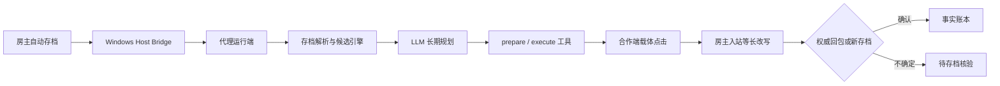

<!-- SPDX-FileCopyrightText: 2026 Imperial Auto Governor contributors -->
<!-- SPDX-License-Identifier: CC-BY-SA-4.0 -->

# 技术说明

Imperial Auto Governor 将“思考”和“可执行权限”分开。模型可以阅读整局会话、十年计划、紧急状态、存档快照和不可信网页资料，但只能调用本地工具暴露的合法候选；它不能自行编造行星 ID、槽位或游戏命令。

## 状态与规划

- 每个战役会话拥有独立 SQLite 历史、十年计划、紧急状态和执行账本。
- 十年计划按游戏日期维护；临近到期时开放下一期草案。
- 紧急状态由玩家显式开启和结束，激活期间优先覆盖十年计划。
- 上下文接近玩家设置的比例时生成滚动概况；完整原始会话仍保留在 SQLite 中。

## 执行语义

- `confirmed_by_packet`：房主权威回包明确确认。
- `confirmed_by_save`：较新的同步存档证明动作落地。
- `provisional_pending_save`：已安全改写但回包目标不可识别；仅在玩家启用宽松串行策略时允许继续，绝不称为完成。
- `rejected_by_save`：新存档没有出现预期变化，动作被事实账本否决。
- 每个战役的已接受上传拥有单调递增 revision。执行清单固定记录源哈希与源 revision；玩家可允许既有批次落后有限个 revision，但不能跨战役、篡改源文件或越过墙钟时效。
- 模型任务全局串行。任务运行期间错过的复查边界在结束时合并到下一个周期，避免旧档分析尚未结束时又启动新一轮。
- 固定点击界面模板校验默认开启并记录匹配分数；玩家关闭后只绕过模板分数拒绝，窗口唯一性、尺寸与目标边界仍然强制检查。
- 建筑升级是正常长期投资；建筑替换只会在存档同时给出当前拥有者和不同的原始拥有者时进入候选，并绑定源建筑对象 ID、区域和槽位。模型不得把自己规划的殖民地当作常规替换对象。
- 网页紧急停止是持久执行锁。停止完成后，玩家必须通过“解除紧急停止”显式恢复新执行；运行中的任务尚未退出时不能提前解除。

## 网页检索

`search_web` 通过 SearXNG 获取结果，`fetch_page` 通过 Crawl4AI 提取正文，`search_stellaris_wiki`
优先通过 MediaWiki API 查询 Wiki，并在 API 被客户端挑战或返回非 JSON 时退回受白名单约束的
SearXNG 站内检索。返回内容含标题、URL、来源类型和限长正文；URL 必须来自本轮搜索或 Wiki 结果，
目标域名受白名单限制，私网和回环抓取被拒绝。网页总开关关闭时，工具定义不会发给模型，直接调用
也会被本地拒绝。网页只能影响分析，不能越过合法候选与确认层。

## 发布边界

同一源码状态生成四个独立归档：完整公开源码、Windows Agent、Windows Host Bridge 和 Ubuntu Agent。每个归档都带独立 manifest 与包内 SHA-256 清单；顶层 `SHA256SUMS-0.5.7.txt` 再覆盖四个归档。发布验证会对实际压缩包执行路径穿越、符号链接、禁止文件、凭据、邮箱、个人路径、真实地址、文件列表与哈希一致性检查，并在解压目录重新运行对应测试或健康检查。
